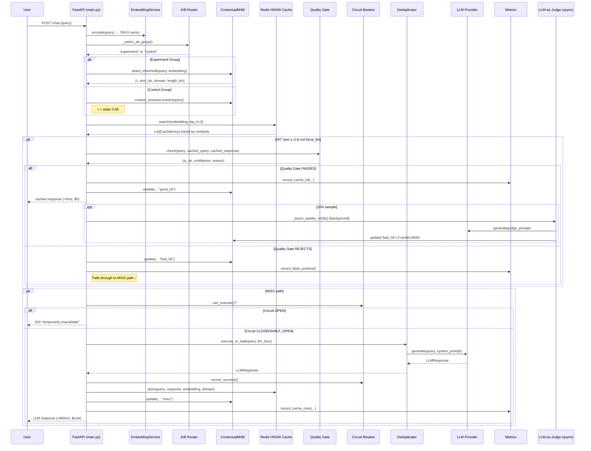

# Semantic Cache System — Deep Dataflow Analysis & Flaw Report

---

## 1. End-to-End Dataflow



---

## 2. Component-by-Component Breakdown

### 2.1 [embeddings.py](file:///c:/Users/Pojesh/Documents/Capstone/working/semantic-caching-calude01/semantic-cache/app/embeddings.py) — EmbeddingService

| Aspect | Detail |
|--------|--------|
| **Purpose** | Converts raw text queries into 768-dimensional dense vectors |
| **Model** | `sentence-transformers/all-mpnet-base-v2` (CUDA-accelerated) |
| **Pattern** | Singleton — model loaded once at startup, reused for all requests |
| **Output** | L2-normalized vectors, so cosine similarity = dot product |

**How it fits**: This is the **first step** for every incoming query. The embedding is used downstream by both the Redis HNSW search (to find similar cached queries) and the MAB context extractor.

---

### 2.2 [cache.py](file:///c:/Users/Pojesh/Documents/Capstone/working/semantic-caching-calude01/semantic-cache/app/cache.py) — VectorCache

| Aspect | Detail |
|--------|--------|
| **Purpose** | Stores & retrieves query-response pairs using vector similarity |
| **Backend** | Redis Stack with HNSW index (approximate nearest neighbor) |
| **Key format** | `cache:{MD5(query)[:12]}` — content-addressed to avoid duplicates |
| **Schema** | query, response, domain, timestamp, hit_count, embedding (FLOAT32) |
| **Search** | KNN search → returns top-k entries with cosine distance → converted to similarity |
| **TTL** | Domain-aware: factual=1h, code=7d, math=30d, creative=3d, general=1d |

**How it fits**: After embedding, the system searches this cache. On a HIT, the response is returned (after quality gate). On a MISS, the LLM response is stored here for future queries.

---

### 2.3 [mab.py](file:///c:/Users/Pojesh/Documents/Capstone/working/semantic-caching-calude01/semantic-cache/app/mab.py) — ContextualMAB + EnhancedContextExtractor

| Aspect | Detail |
|--------|--------|
| **Purpose** | Adaptively selects the optimal similarity threshold (τ) per context |
| **Algorithm** | Thompson Sampling with Beta(α, β) distributions |
| **Arms** | 9 thresholds: [0.75, 0.78, 0.80, 0.82, 0.85, 0.88, 0.90, 0.92, 0.95] |
| **Context** | 4 features: domain × length_bin × complexity × specificity |
| **Rewards** | `good_hit` → α+1; `bad_hit` → β+2; [miss](file:///c:/Users/Pojesh/Documents/Capstone/working/semantic-caching-calude01/semantic-cache/app/metrics.py#79-98) → β+0.3 |
| **Persistence** | State saved to [mab_state.json](file:///c:/Users/Pojesh/Documents/Capstone/working/semantic-caching-calude01/semantic-cache/mab_state.json) every 50 decisions |

**Context Extraction (EnhancedContextExtractor):**
- **Domain**: Keyword-matching into code/math/factual/creative/general
- **Length bin**: short (≤8 words), medium (9-25), long (>25)
- **Complexity**: simple / compound (multi-hop, comparisons) / multi_entity (many numbers)
- **Specificity**: generic (<2 markers) / specific (≥2 quoted terms, versions, proper nouns)

**How it fits**: Before searching the cache, the MAB samples from Beta distributions to choose which threshold arm to use for this query context. After the outcome (hit/miss/quality gate result), it updates the distributions to learn better thresholds over time.

---

### 2.4 [quality.py](file:///c:/Users/Pojesh/Documents/Capstone/working/semantic-caching-calude01/semantic-cache/app/quality.py) — QualityChecker + LLM-as-Judge

| Aspect | Detail |
|--------|--------|
| **Purpose** | Prevents false-positive cache hits where the cached response doesn't actually answer the new query |
| **Tier 1 (Heuristic)** | Fast, free — runs on every HIT |
| **Tier 2 (LLM Judge)** | Slow, costs tokens — sampled at 10% |

**Heuristic checks (Tier 1):**
1. **Intent mismatch** — "how" vs "why" vs "what" in first 5 words → -0.4 confidence
2. **Entity mismatch** — Different numbers, quoted strings, function names → -0.5
3. **Empty/short response** — → -0.8 / -0.3
4. **Negation mismatch** — One query has "not"/"don't" and the other doesn't → -0.6

**Decision**: `confidence > 0.5` → acceptable

**How it fits**: After a cache search returns a HIT (sim ≥ τ), the quality gate acts as a second filter before returning the cached response. If it rejects, the query falls through to the LLM path and the MAB receives a `bad_hit` signal.

---

### 2.5 [llm.py](file:///c:/Users/Pojesh/Documents/Capstone/working/semantic-caching-calude01/semantic-cache/app/llm.py) — LLMProvider

| Aspect | Detail |
|--------|--------|
| **Purpose** | Abstraction layer for generating responses from LLMs |
| **Providers** | Ollama (local, free) and Groq (cloud, paid) |
| **Cost tracking** | Per-call input/output tokens and USD |
| **Timeout** | 60s for Ollama, 30s for Groq |

**How it fits**: Called only on cache MISSes (or quality gate rejections). Protected by the circuit breaker and deduplicator. Its responses are cached for future queries.

---

### 2.6 [resilience.py](file:///c:/Users/Pojesh/Documents/Capstone/working/semantic-caching-calude01/semantic-cache/app/resilience.py) — CircuitBreaker + RequestDeduplicator + CacheWarmer

#### Circuit Breaker
| State | Behavior |
|-------|----------|
| **CLOSED** | Normal — LLM calls proceed |
| **OPEN** | After 5 consecutive failures — all LLM calls rejected with 503 |
| **HALF_OPEN** | After 30s recovery timeout — allows one probe call |

#### Request Deduplicator
- Collapses identical concurrent queries into one LLM call
- Exact match via MD5 of lowercased+stripped query
- Pending entries expire after 2s window

#### Cache Warmer (not wired in [main.py](file:///c:/Users/Pojesh/Documents/Capstone/working/semantic-caching-calude01/semantic-cache/app/main.py))
- Pre-populates cache with common queries on startup
- Loads from `warmup_queries.json` or uses 16 hardcoded defaults

---

### 2.7 [metrics.py](file:///c:/Users/Pojesh/Documents/Capstone/working/semantic-caching-calude01/semantic-cache/app/metrics.py) — MetricsCollector

| Aspect | Detail |
|--------|--------|
| **Purpose** | Track and expose performance metrics |
| **In-memory** | Hit/miss counts, latencies, costs, quality scores, per-domain & per-A/B-group |
| **Prometheus** | Counters (hits, misses, false positives, cost), Histogram (latency), Gauges (hit rate, threshold) |
| **A/B tracking** | Separate stats per group for experiment vs control comparison |

---

### 2.8 [main.py](file:///c:/Users/Pojesh/Documents/Capstone/working/semantic-caching-calude01/semantic-cache/app/main.py) — FastAPI Server (Orchestrator)

Ties everything together. Key logic:
1. Embed query
2. Route to A/B group
3. Select threshold (MAB or static)
4. Search cache → quality gate
5. If miss → circuit breaker → dedup → LLM → cache result
6. Return response with full metadata

---

### 2.9 [mab_enhanced.py](file:///c:/Users/Pojesh/Documents/Capstone/working/semantic-caching-calude01/semantic-cache/app/mab_enhanced.py) — Dead Code / Sketch File

A 21-line stub with an [EnhancedContextExtractor](file:///c:/Users/Pojesh/Documents/Capstone/working/semantic-caching-calude01/semantic-cache/app/mab_enhanced.py#3-22) skeleton. **Never imported anywhere.** The actual enhanced extractor lives inside [mab.py](file:///c:/Users/Pojesh/Documents/Capstone/working/semantic-caching-calude01/semantic-cache/app/mab.py#L76-L153). This file references `np` without importing it and has incomplete methods.

---

## 3. Flaws & Issues Found

### 🔴 Critical Flaws

#### F1. MAB Update Uses Wrong Context on Cache Hits
In [main.py:163](file:///c:/Users/Pojesh/Documents/Capstone/working/semantic-caching-calude01/semantic-cache/app/main.py#L162-L163), the `mab.update()` call passes only [domain](file:///c:/Users/Pojesh/Documents/Capstone/working/semantic-caching-calude01/semantic-cache/app/mab.py#95-113) and [length_bin](file:///c:/Users/Pojesh/Documents/Capstone/working/semantic-caching-calude01/semantic-cache/app/mab.py#114-121), but **not [complexity](file:///c:/Users/Pojesh/Documents/Capstone/working/semantic-caching-calude01/semantic-cache/app/mab_enhanced.py#15-22) or [specificity](file:///c:/Users/Pojesh/Documents/Capstone/working/semantic-caching-calude01/semantic-cache/app/mab.py#136-153)**:
```python
mab.update(domain, length_bin, arm_idx, "good_hit", similarity=best.similarity)
```
But the MAB's [update()](file:///c:/Users/Pojesh/Documents/Capstone/working/semantic-caching-calude01/semantic-cache/app/mab.py#226-257) method defaults `complexity="simple"` and `specificity="generic"` when these aren't provided. This means:
- **Selection** uses the full 4-feature context key (e.g., `code:short:compound:specific`)
- **Update** writes to a *different* context key (e.g., `code:short:simple:generic`)
- **The MAB is learning on the wrong arms** — the entire feedback loop is broken for any non-simple, non-generic query.

This is the **most critical bug** in the system. The same issue exists at lines 187 and 215.

#### F2. Feedback Endpoint Does Nothing
[main.py:254-256](file:///c:/Users/Pojesh/Documents/Capstone/working/semantic-caching-calude01/semantic-cache/app/main.py#L254-L256):
```python
@app.post("/feedback")
async def feedback(req: FeedbackRequest):
    return {"status": "recorded", "helpful": req.was_helpful}
```
This is a no-op. The user's feedback is **never stored, never used to update the MAB, and never recorded in metrics**. The endpoint exists to deceive the dashboard/user into thinking feedback is being captured.

#### F3. Cache Warmer Is Never Invoked
[CacheWarmer](file:///c:/Users/Pojesh/Documents/Capstone/working/semantic-caching-calude01/semantic-cache/app/resilience.py#156-222) is defined in [resilience.py:156-221](file:///c:/Users/Pojesh/Documents/Capstone/working/semantic-caching-calude01/semantic-cache/app/resilience.py#L156-L222) but **never instantiated or called** in the lifespan handler or anywhere in [main.py](file:///c:/Users/Pojesh/Documents/Capstone/working/semantic-caching-calude01/semantic-cache/app/main.py). Even though `config.resilience.warmup_enabled` exists, there's no code path that triggers it.

---

### 🟠 Significant Design Issues

#### F4. Synchronous Embedding on Async Endpoint
[main.py:127](file:///c:/Users/Pojesh/Documents/Capstone/working/semantic-caching-calude01/semantic-cache/app/main.py#L127):
```python
embedding = embedder.encode(query)  # synchronous, blocks event loop
```
`embedder.encode()` is a synchronous PyTorch inference call. On a FastAPI async endpoint, this **blocks the entire event loop** during embedding computation (~5-50ms). Under concurrent load this serializes all requests. Should be wrapped in `asyncio.to_thread()` or run in a thread pool.

#### F5. Quality Gate Confidence Math Can Go Negative
In [quality.py](file:///c:/Users/Pojesh/Documents/Capstone/working/semantic-caching-calude01/semantic-cache/app/quality.py#L27-L59), confidence starts at 1.0 and deductions can stack:
- Intent mismatch: -0.4
- Entity mismatch: -0.5
- Negation mismatch: -0.6

If all three fire, confidence = 1.0 - 0.4 - 0.5 - 0.6 = **-0.5**. While functionally this still rejects (< 0.5 threshold), negative confidence values are returned to the API response's `quality_confidence` field, which is semantically meaningless.

#### F6. MD5 Hash-Based Cache Keys Cause Silent Overwrites
[cache.py:143](file:///c:/Users/Pojesh/Documents/Capstone/working/semantic-caching-calude01/semantic-cache/app/cache.py#L143):
```python
key_hash = hashlib.md5(query.encode()).hexdigest()[:12]
```
Using only the first 12 hex characters (48 bits) of an MD5 hash. With ~50,000 max cache entries, the birthday paradox gives a non-trivial collision probability. Two different queries could silently overwrite each other's cache entries.

#### F7. `httpx.Client` Created But Never Used For Async Calls
[llm.py:57](file:///c:/Users/Pojesh/Documents/Capstone/working/semantic-caching-calude01/semantic-cache/app/llm.py#L57):
```python
self._client = httpx.Client(timeout=30.0)  # sync client
```
This sync client is created but **never used**. Both [_ollama_generate()](file:///c:/Users/Pojesh/Documents/Capstone/working/semantic-caching-calude01/semantic-cache/app/llm.py#69-116) and [_groq_generate()](file:///c:/Users/Pojesh/Documents/Capstone/working/semantic-caching-calude01/semantic-cache/app/llm.py#117-167) create fresh `httpx.AsyncClient()` instances for every single request. This means:
- A connection pool is never reused (wasteful)
- TCP/TLS handshake on every LLM call (extra latency)
- The sync `_client` hangs around consuming resources for nothing

#### F8. Deduplicator Has a Subtle Race + Delays Response
[resilience.py:130-145](file:///c:/Users/Pojesh/Documents/Capstone/working/semantic-caching-calude01/semantic-cache/app/resilience.py#L130-L145): After completing the LLM call, the deduplicator `await asyncio.sleep(self._window)` (2s!) before removing the pending entry. This means:
- The **first requester** waits an **extra 2 seconds** after the LLM response before its coroutine completes
- The `finally` block stalls the response delivery

#### F9. Estimated Cost Saved Is Speculative
[main.py:154-157](file:///c:/Users/Pojesh/Documents/Capstone/working/semantic-caching-calude01/semantic-cache/app/main.py#L154-L157):
```python
estimated_tokens = len(query.split()) * 2 + 150
```
This "estimation" of tokens saved by cache hits is a rough heuristic: `word_count * 2 + 150`. For code queries, for long queries, or for responses of vastly different lengths, this can be wildly inaccurate. The system reports these fictional savings in metrics, which undermines the credibility of cost ROI claims.

---

### 🟡 Minor Issues

#### F10. [mab_enhanced.py](file:///c:/Users/Pojesh/Documents/Capstone/working/semantic-caching-calude01/semantic-cache/app/mab_enhanced.py) Is Dead Code
This file has an incomplete [EnhancedContextExtractor](file:///c:/Users/Pojesh/Documents/Capstone/working/semantic-caching-calude01/semantic-cache/app/mab_enhanced.py#3-22) class that references `np` without importing it. It's never imported anywhere. It appears to be an early sketch that was superseded by the implementation inside [mab.py](file:///c:/Users/Pojesh/Documents/Capstone/working/semantic-caching-calude01/semantic-cache/app/mab.py).

#### F11. No Cache Eviction Policy
`config.cache.max_entries = 50000` is set but **never enforced**. There's no code anywhere that checks the cache size or evicts entries (beyond TTL expiration). If TTLs are long (e.g., math at 30 days), Redis memory can grow unbounded.

#### F12. Domain Detection Is Keyword-Only
Domain detection in [mab.py:95-112](file:///c:/Users/Pojesh/Documents/Capstone/working/semantic-caching-calude01/semantic-cache/app/mab.py#L95-L112) relies on a hardcoded keyword list. Queries like "What is the integral of x^2?" would correctly detect "math" because "integral" is in the list, but a query like "How does backpropagation compute gradients?" — clearly a math-adjacent ML query — would land in "general" since none of the keywords match.

#### F13. CORS Allows All Origins
[main.py:74-79](file:///c:/Users/Pojesh/Documents/Capstone/working/semantic-caching-calude01/semantic-cache/app/main.py#L74-L79): `allow_origins=["*"]` is a security concern for production. Fine for development, but should be locked down.

#### F14. No Authentication / Rate Limiting
The API has no auth tokens, API keys, or rate limiting. Any client can flush the cache, submit unlimited queries, or abuse the LLM budget.

#### F15. Global Service Variables Are Not Thread-Safe
[main.py:41-47](file:///c:/Users/Pojesh/Documents/Capstone/working/semantic-caching-calude01/semantic-cache/app/main.py#L41-L47): All services are stored as module-level global `Optional` variables. While FastAPI is single-threaded by default, using `uvicorn --workers N` for production would create separate processes, each with its own MAB state, leading to fragmented learning.

#### F16. Metrics Lists Grow Unboundedly
In [metrics.py](file:///c:/Users/Pojesh/Documents/Capstone/working/semantic-caching-calude01/semantic-cache/app/metrics.py#L30-L32), `_latencies_cache`, `_latencies_llm`, and `_quality_scores` are plain lists that grow forever. Under sustained traffic, these will consume increasing memory. Should be bounded (e.g., rolling window or reservoir sampling).

---

## 4. Flaw Severity Summary

| ID | Flaw | Severity | Effort to Fix |
|----|------|----------|---------------|
| F1 | MAB update uses wrong context key | 🔴 Critical | Medium — pass complexity/specificity through |
| F2 | Feedback endpoint is a no-op | 🔴 Critical | Low — wire to MAB/metrics |
| F3 | Cache warmer never invoked | 🟠 Significant | Low — add to lifespan |
| F4 | Sync embedding blocks event loop | 🟠 Significant | Low — wrap in `asyncio.to_thread()` |
| F5 | Confidence can go negative | 🟡 Minor | Low — clamp to [0, 1] |
| F6 | 48-bit hash → collision risk | 🟠 Significant | Low — use full hash |
| F7 | Unused sync httpx client + new async client per call | 🟠 Significant | Medium — use shared async client |
| F8 | Dedup sleep(2s) delays response | 🟠 Significant | Medium — move sleep to background |
| F9 | Estimated cost saved is speculative | 🟡 Minor | Medium — use actual cached response tokens |
| F10 | [mab_enhanced.py](file:///c:/Users/Pojesh/Documents/Capstone/working/semantic-caching-calude01/semantic-cache/app/mab_enhanced.py) is dead code | 🟡 Minor | Trivial — delete file |
| F11 | No cache eviction enforcement | 🟡 Minor | Medium — add LRU/size check |
| F12 | Keyword-only domain detection | 🟡 Minor | High — use embedding-based classification |
| F13 | CORS allows all origins | 🟡 Minor | Low — restrict in production |
| F14 | No auth / rate limiting | 🟡 Minor | Medium — add API key middleware |
| F15 | Multi-worker MAB fragmentation | 🟡 Minor | High — use Redis-backed MAB state |
| F16 | Unbounded metrics lists | 🟡 Minor | Low — use deque with maxlen |

---

## 5. Architecture Strengths

To be balanced, the system does several things well:

1. **Clean module separation** — Each concern (embedding, cache, MAB, LLM, quality, resilience, metrics) is in its own file with a clear interface.
2. **Contextual bandit approach** — Using Thompson Sampling per-context rather than a single global threshold is genuinely innovative vs GPTCache/MeanCache.
3. **Two-tier quality gate** — Heuristic + sampled LLM-as-judge is a pragmatic compromise between accuracy and cost.
4. **A/B testing framework** — Built-in experiment/control routing enables rigorous comparison.
5. **Circuit breaker pattern** — Proper state machine (CLOSED→OPEN→HALF_OPEN) protects against cascading failures.
6. **Comprehensive evaluation suite** — Benchmark against 5+ baselines, ablation studies, and failure mode analysis.
